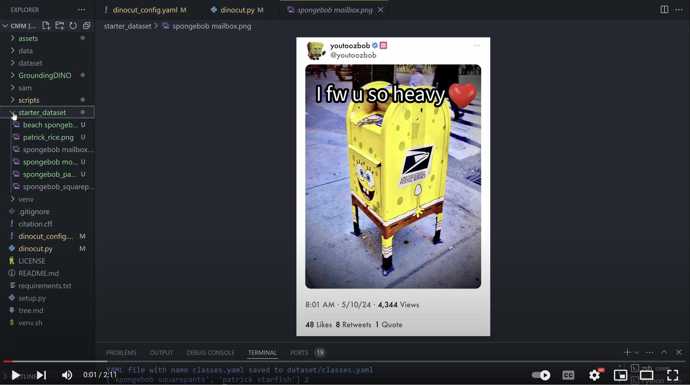

<div align="center">
    
</div>


# 🦖 DinoCut ✂️
[](https://www.youtube.com/watch?v=Cf0wft5CKT4) [](https://colab.research.google.com/drive/1xbq9rEOtyQh8QUQU-__E-Ub3Wy3X1NoV)[](https://arxiv.org/abs/2303.05499) [](https://arxiv.org/abs/2304.02643) [](https://arxiv.org/abs/1708.01642) [](https://arxiv.org/abs/2401.14159)

[](https://GitHub.com/Naereen/StrapDown.js/graphs/commit-activity) [](https://pypi.python.org/pypi/ansicolortags/)

#  About 

DINOcut is an AVCA image-processing pipeline that procedurally generates synthetic datasets for object detection tasks using GroundingDINO, SAM, and Cut Paste Learn. When combined with popular deep learning frameworks for real-time object detectors, such as Recurrent Convolutional Neural Networks (RCNNs) and Single Shot Detectors (SSDs) DINOcut allows researchers to detect custom object classes in real-time (20fps) using social media video streams or image data.


#  DEMO 

[](https://youtu.be/n6LSkqTaKd8 "DINOcut DEMO Video")


#  Usage
1. Modify dinocut_config.yaml to specify the paths for your input images, model parameters, and input prompts. Make sure to include full paths: example/path/to/my/directory
2. Upload background and distractor objects to the background and bg_noise directories: 
```bash
├── data
│   ├── background
│   ├── bg_noise
│       ├── images
│       ├── masks
```
Our original implementation uses [Li et al's 2021 BG-20K dataset](https://paperswithcode.com/dataset/bg-20k) accessible [here](https://drive.google.com/drive/folders/1ZBaMJxZtUNHIuGj8D8v3B9Adn8dbHwSS). 

Distractor objects saved in the bg_noise directory should contain seperate folders for images and masks. You can download mask and image files for distactors from [shapenet](https://shapenet.org/) or make your own. 

3. Configure your dinocut_congif.yaml file with your text prompt and specified data augmentation parameters. 
4. Run DINOCUT from the command line: 
```bash
python3 dinocut.py 
```
5. Review segmentation masks and delete false positives: 

6. Sit back and relax as DINOcut generates your dataset. 

7. You can also use our [Cut, Paste, Learn](https://arxiv.org/abs/1708.01642) implementation as a standalone CLI: 
```bash
python3 sythetic.py -h
```

# 🧠 Conceptual Design 📚 
The goal of this project is simple: to combine sommething old with soemthing new. So we've created an image processing pipeline for object detection using Grounding DINO; SAM; and a Cut, Paste Learn approach. The result is a semi-supervised image processing pipeline that allows users to generate large, synthetic datasets for object detection without the hassle of manually labeling bounding boxes or creating segmentation masks. 

<div align="center">
    
</div>
 
# 🔧 Install 
DINOcut was designed for CUDA-enabled devices running a Ubuntu 22.04 operating system with Python 3.10.12. The preffered method of installation is from source on a unix operating system with a CUDA-enabled device or WSL for windows users. You can also install DINOcut with Docker.

***Direct from source:***

1. Clone DinoCut from GitHub: 
     ```bash
    git clone https://github.com/Nalaquq/DINOcut.git
    ```

2. Create and activate your virtual environment:
    ```bash
    python3 -m venv venv
    source venv.sh
    ```

3.  Run setup.py
    ```bash
    python3 setup.py
    ```


**DOCKER Install**

## Running the Application in Docker

1. **Clone the repository:**

    ```sh
    git clone https://github.com/Nalaquq/DINOcut.git
    cd DINOcut
    ```

2. **Build the Docker image:**

    ```sh
    docker build -t dinocut .
    ```

3. **Run the Docker container:**

    ```sh
    docker run -p 80:80 dinocut
    ```

    This will start the application and make it accessible on port 80.


# 😳 Troubleshooting 


**Virtual Environments:**

We strongly encourage the use of a [python virtual environment](https://docs.python.org/3/library/venv.html) to manage packages and paths. To create a virtual environment use the following command: 

```bash
python3 -m venv venv
```

To activate your virtual environment use the following command at the beginning of each session: 

```bash
python3 source venv/bin/activate
``` 

or use the venv.sh script to acivate the environment and create an up to date directory map of your project:

```bash
source venv.sh
``` 
At the end of your session deactivate the venv: 

```bash
deactivate
``` 

**CUDA Support**

DinoCut is designed to work with [CUDA](https://pytorch.org/get-started/locally/) given it's reliance on [Grounding Dino](https://github.com/IDEA-Research/GroundingDINO/tree/main) and [SAM](https://github.com/facebookresearch/segment-anything). To use CUDA you will need to ensure that your environment variable `CUDA_HOME` is set. 

Please make sure following the installation steps, 
 
#### Check CUDA_HOME Path:
```bash
echo $CUDA_HOME
```
If it print nothing, then it means you haven't set up the path/

Run this so the environment variable will be set under current shell. 
```bash
export CUDA_HOME=/path/to/cuda-11.8
```
In this example, /path/to/cuda-11.8 should be replaced with the path where your CUDA toolkit is installed. You can find this by typing **which nvcc** in your terminal:

For instance, 
if the output is /usr/local/cuda/bin/nvcc, then:
```bash
export CUDA_HOME=/usr/local/cuda/bin/nvcc/cuda-11.8
```

Notice the version of cuda should be aligned with your CUDA runtime in case you have multiple CUDA version installed. 

If you want to set the CUDA_HOME permanently, store it using:

```bash
echo 'export CUDA_HOME=/path/to/cuda' >> ~/.bashrc
```
after that, source the bashrc file and check CUDA_HOME:
```bash
source ~/.bashrc
echo $CUDA_HOME
```

**Trouble Shooting CUDA:**

https://github.com/IDEA-Research/GroundingDINO/issues/193 


 # 📓 Resources & Inspiration # 

 [ImageBot](https://www.sciencedirect.com/science/article/pii/S2212827122002876?ref=pdf_download&fr=RR-2&rr=87b01ff6f8558bb9): A cut paste learn approach approach developed by Block et. al (2022). [Github Repo](https://github.com/FraunhoferIAO/Image-Bot)


# 📂 Project Structure 📂

    .
    ├── assets              # figures, images, etc. 
    ├── data                # data used to generate synthetic data with DINOcut or synthetic.py
    ├── dataset             # The final dataset containing images and annotations
    ├── GroundingDINO       # GroundingDINO model installed by setup.py
    ├── sam                 # The Segment Anything Model and weights downloade by setup.py
    ├── scripts             # Utility functions and synthetic.py
    ├── starter_dataset     # Directory to place scraped images into this folder for DINOcut to parse.
    ├── citation.cff        # Relevent citations for the project
    ├── dinocut_config.yaml # yaml file for DINOcut settings
    ├── dinocut.py          # the main app for DINOcut
    ├── LICENSE             # Apache liscence 
    ├── README.md           # readme docs
    ├── requirements.txt    # latest PIP dependencies 
    └── setup.py	        # setup script
    └── venv.sh             # inits the virtual environment and creates a full markdown tree of project materials


# Languages & Dependencies 
[](https://www.python.org/)
[](https://github.com/psf/black)


